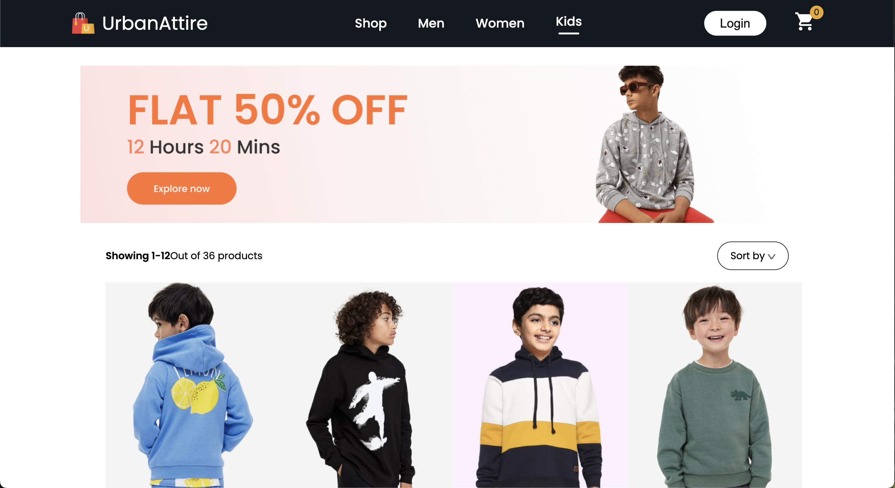

  
  <h1>UrbanAttire</h1>

<h2>About the project</h2>

  
UrbanAttire is a premier e-commerce platform dedicated to bringing the latest trends in streetwear fashion to style enthusiasts worldwide. Designed with a modern, user-friendly interface, UrbanAttire offers a seamless shopping experience, combining cutting-edge design with an extensive range of high-quality apparel and accessories.

👉 Live Demo: <a href='https://car-rental-ten.vercel.app/'>Live Demo</a>

<h3>Build with:</h3>

» React JS  
» Material UI

<h2>Screenshot</h2>
 
<h3 align='center'>Home Page 🏡</h3>

Homepage

Men's Fashion

Women's Fashion

Kid's Fashion

